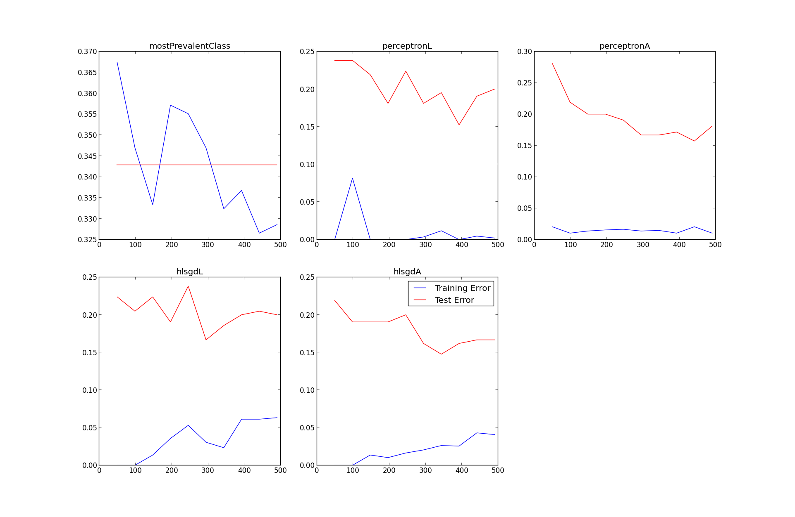

# Will Whitney

## Project 1.2 Part C

### Experiment

In my tests, I used these parameters.

    number of folds = 10
    number of epochs = 10
    lambda = 0.01

### Results

In this test, the averaged perceptron algorithm performed the best, with an error rate of about 0.15.

    Error Rate for mostPrevalentClass: 0.332857142857
    Error Rate for perceptronL: 0.167142857143
    Error Rate for perceptronA: 0.154285714286
    Error Rate for hlsgdL: 0.197142857143
    Error Rate for hlsgdA: 0.168571428571

## Project 1.2 Part D

### Experiment

In running this experiment, I constructed a function `buildLearningCurve(alg, X, Y)`, which: 

1. split the X and Y matrices into the 70/30 training/test sets
2. for each subset 10%, 20%, 30%, etc of the training set:
	a. trained `alg` on that subset
	b. tested `alg`'s performance on both that training subset and the test set
3. returned the triple `(trainSetSizes, trainErrors, testErrors)` of all the results of `alg`

Then, I created a function `plotAllLearningCurves()` which ran `buildLearningCurve` for each of the five algorithms and plotted the results as an error fraction, #errors / #datapoints, where #datapoints was, respectively, the size of the training subset or the size of the test set.

### Results

Though this may be hard to see from the graphs, `perceptronA` and `hlsgdA` had very similar results on the largest of the training samples, `perceptronA` at about 18% error and `hlsgdA` at about 16.5%. `perceptronA` seems to learn the most smoothly, but we would need more data to verify that. As might be expected, the performance of the 'last' versions of the algorithms is somewhat more unreliable than that of the 'average' versions, since there can be 'bounce', or oscillation, in the quality of whichever $$$\theta$$$ is returned.

## Project 1.2 Part E

### Experiment

My experiment for this section was to see if including word counts in the tweet vectors, instead of just word indicator variables, would improve the accuracy of any or all of the algorithms.

To do this, I implemented the functions `tweetsToXWordcounter(tweetList)`, `processFileWithCounts()`, and `cvAlgsWithWordCounts()`. These simply provide different tweet vectors to the algorithms, and then the normal cross-validation process on all the algorithms begins.

These tweet vectors may now be of the form `[1 2 4 …, 0 1 0]` instead of containing only zeros and ones.

The full code is included in `tweetLearner.py`.

### Results

As it turned out, the results for this method were worse almost across the board than the results for the original, indicator-variable method.

type               | Cross-validation (indicator) | Cross-validation (count)
-------------------|------------------------------|-------------------------
mostPrevalentClass | 0.332857142857               | 0.332857142857
perceptronL        | 0.181428571429               | 0.24
perceptronA        | 0.151428571429               | 0.152857142857
hlsgdL             | 0.171428571429               | 0.278571428571
hlsgdA             | 0.164285714286               | 0.16  

While the results for `hlsgdA` are actually slightly better, this is probably simply noise.

